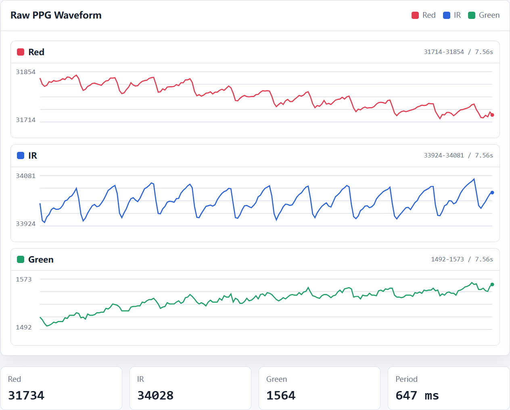
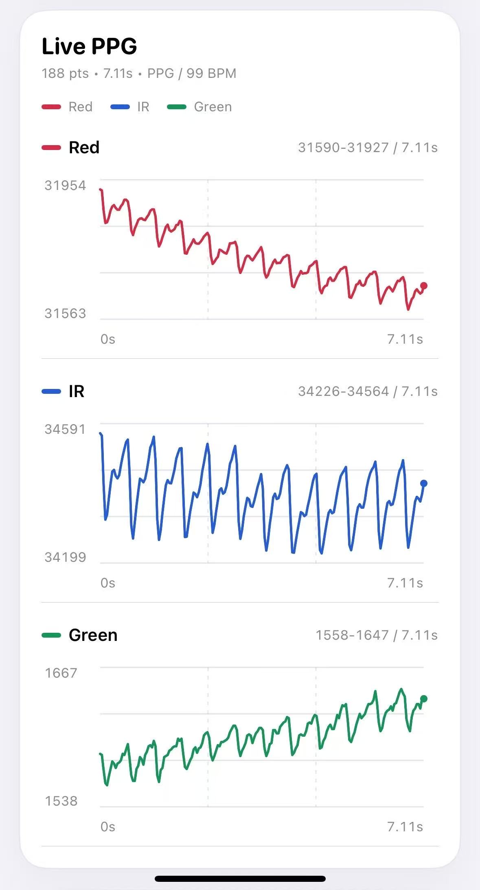

# MAX30101_PPG_APP

这是一个用于 MAX30101 三通道原始 PPG 采集和实时波形查看的小项目。

仓库包含：

- `MAX30101/MAX30101.ino`：Seeed Studio XIAO nRF52840 固件，通过 BLE 发送 Red / IR / Green 原始 PPG 数据。
- `index.html`：网页端 Web Bluetooth 实时看板，可直接连接 `JingQiPPG` 并显示波形。
- `PPGMonitor.xcodeproj` / `PPGMonitor/`：iOS SwiftUI 实时 PPG 看板。
- `docs/features.md`：硬件连接、Arduino 依赖、BLE 协议和运行方式说明。
- `docs/images/`：网页端和 iOS 端效果图。

## 效果图

### 网页端蓝牙

### iOS 端

## 快速入口

- 功能说明：[docs/features.md](docs/features.md)
- 网页端页面：[index.html](index.html)
- iOS 工程：`PPGMonitor.xcodeproj`
- BLE 设备名：`JingQiPPG`
